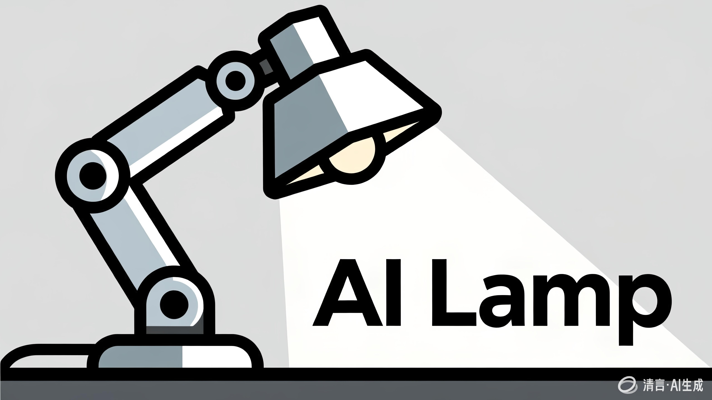

# AI Lamp



这是一个基于LeLamp台灯修改的开源项目。完善了视觉功能，接入了国产模型：GLM智普大模型。

之所以选择GLM模型是其对中文的理解能力更好；其次GLM部分版本模型完全免费使用，适合初学者入门学习；第三是GLM带有ServerVAD功能，无需本地做唤醒词处理，降低客户端开发难度和硬件成本。

作为LeLamp的衍生版本，本项目修改了原代码在树莓派3B上的部分问题。


## 一、 概述

项目基于python编程，硬件资源包含以下部分:

- 五个STS3215串口总线舵机
- 音频扩展板 (含麦克风和单声道喇叭)
- WS2812灯板
- UVC摄像头模块
- 主控树莓派开发板（zero2w/3b/4b/5）
- DCDC降压模块
- 舵机控制板


## 二、 代码结构

```
lelamp_runtime/
├── lelamp_main.py         # 主程序入口
├── message_handler.py	   # 大模型消息处理
├── pyproject.toml         # 项目配置文件和安装依赖
├── lelamp/                # Core package
│   ├── setup_motors.py    # 电机管理和设置
│   ├── calibrate.py       # 电机校准
│   ├── list_recordings.py # 动作列表
│   ├── record.py          # 动作捕捉存储
│   ├── replay.py          # 动作回放
│   ├── follower/          # follower模式
│   ├── leader/            # Leader模式
│   └── test/              # 硬件功能单元测试
└── uv.lock                # uv文件
```

## 三、 硬件原理图


## 四、 运行环境安装

### 4.1 树莓派系统安装

#### 4.1.1 操作系统

Windows环境下系统安装方式：

* 下载树莓派官方烧录软件pi imager

* 根据步骤下载烧录最新系统镜像（选择64bit系统镜像），带桌面版本或者Lite版本都可以。目前为止测试过的可用系统版本：Trixie/Bookworm

#### 4.1.2 网络设置

树莓派中有多种接入网络的方法，可根据情况使用以下方式：

(1) 网线接入。这种方式仅适用于树莓派3b/4b/5等带网口的开发板，Zero2W仅提供WiFi接入。

(2) WiFi接入。通过WiFi入网，需要设置连接热点和密码。设置或修改热点有下面几种方法：

* 可以在使用imager软件烧录镜像时，在烧录步骤中根据提示设置好；

* 也可以烧录后，接入HDMI通过外接屏幕键盘，登录树莓派系统使用nmcli命令修改热点或者在具备图形界面的系统中进入系统设置修改热点；

* 还有一种方式是通过通过外接TTL转USB接入个人电脑，通过串口登录树莓派系统后使用nmcli命令修改热点

接入网络后才能使用大模型各种功能。

### 4.2 安装UV包管理工具


### 4.3 安装GLM大模型python客户端SDK


## 五、 整机调试

### 5.1 电源要求

使用的ST3215舵机是7.4v（19kg扭矩）供电，输入电压范围在5v~8.4v之间，建议输入电压与电机匹配，推荐7.5v的电源适配器。当所有硬件模块接入，使用WiFi连接时，电机转动时，功耗达到最大，可能达到2A以上，所以建议使用7.5v/5A规格的适配器。若电源功率达不到要求可能导致WiFi无法正常连接，或者电机转动不到位或动作执行延迟缓慢等现象。

如果使用的ST3215是12v（30kg扭矩）规格的，则对应更换12v/5A规格的电源适配器。

### 5.2 电机设置与校准

#### 5.2.1 电机编号

#### 5.2.2 Leader与follower

#### 5.2.3 零位校准


### 5.3 单元测试

#### 5.3.1 灯光测试

#### 5.3.2 音频测试

#### 5.3.3 摄像头测试

#### 5.3.4 电机测试

#### 5.3.5 大模型接入测试

### 5.4 主程序运行

设置开机启动

## 六、 功能扩展

* 代码兼容Lerobot机器人，只需更换灯光罩为机械手即可改造成Lerobot机械臂。

* 本地训练部署小模型，支持huggingface的预训练模型，实现特定场景的机械臂抓取功能。

## 七、 更多即将更新的功能

### 7.1 动作优化

提供更拟人化的动作序列

### 7.2 机械结构优化

修改外观结构和关节连接，隐藏电机和线路，调整云台结构，使得结构更美观，减少抖动，增强抗摔能力。

### 7.3 低成本方案

兼容使用性价比更高的电机和主控芯片方案，降低成本，提供商业落地

### 7.4 大算力版本，边缘计算实现离线AI

兼容性能更强的主板，实现模型本地化部署推理，支持离线运行。

### 7.5 提供更多大模型的接入案例

接入OpenClaw，OpenAI等……

## 八、 常见问题

