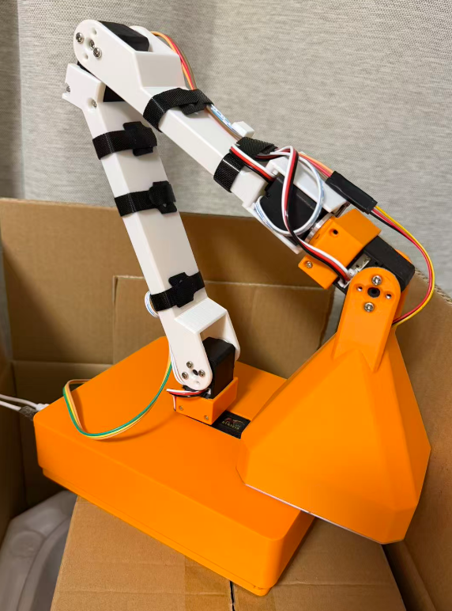

# AI Lamp

这是一个基于LeLamp台灯修改的开源项目。完善了LeLamp中缺少的视觉功能，接入了国产模型：GLM智普大模型，对中文的理解能力更好。

修改了原代码在树莓派3B上的部分问题。



## 概述

代码基于python，硬件资源包含以下部分:

- 五个STS3215串口总线舵机
- 音频扩展板 (含麦克风和单声道喇叭)
- WS2812灯板
- UVC摄像头模块
- 主控树莓派开发板（zero2w/3b/4b/5）

## 代码结构

```
lelamp_runtime/
├── lelamp_main.py         # 主程序入口
├── message_handler.py	   # 大模型消息处理
├── pyproject.toml         # 项目配置文件和安装依赖
├── lelamp/                # Core package
│   ├── setup_motors.py    # 电机管理和设置
│   ├── calibrate.py       # 电机校准
│   ├── list_recordings.py # 动作列表
│   ├── record.py          # 动作捕捉存储
│   ├── replay.py          # 动作回放
│   ├── follower/          # follower模式
│   ├── leader/            # Leader模式
│   └── test/              # 硬件功能单元测试
└── uv.lock                # uv文件
```

## 硬件原理图


## 运行环境安装

### 1. 树莓派系统安装


### 2. 安装UV包管理工具


### 3. 安装GLM大模型python客户端SDK


## 整机调试

### 1. 电机设置与校准

### 2. 单元测试


## 功能扩展

* 代码兼容Lerobot机器人，只需更换灯光罩为机械手即可改造成Lerobot机械臂。

* 本地训练部署小模型，实现特定场景的功能

## 即将更新的功能

### 动作优化

### 机械结构优化

### 低成本方案
